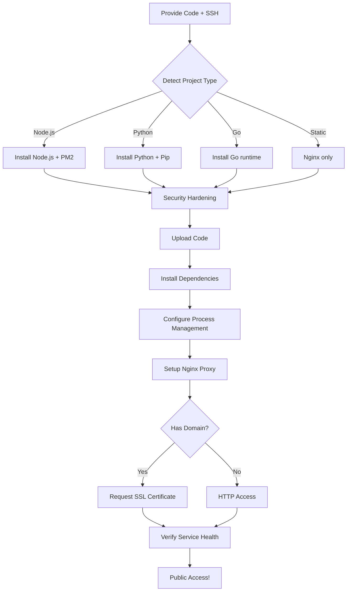

# Website Deployment Quick Start

## Usage

Simply provide **source code + SSH credentials**, and complete the full deployment from development environment to publicly accessible production!

---

## 1. Preparation

### 1.1 Get Server Information

What you need to prepare:

| Item | Example Value | Description |
|------|-------------|-------------|
| **SSH User** | `roo` | Default admin account |
| **Server IP** | `47.100.x.x` | Alibaba Cloud ECS public IP |
| **SSH Port** | `22` | Set in advance if modified |
| **Private Key Path** | `~/.ssh/id_rsa` | SSH key file location |
| **Domain (Optional)** | `example.com` | Required for HTTPS certificate |

### 1.2 Prepare Code

Supported technology stacks:

```bash
# Node.js project
package.json
├── src/
├── package.json  ← Auto-detected

# Python project  
requirements.txt
├── app.py
└── requirements.txt  ← Auto-detected

# Go project
main.go
└── go.mod  ← Auto-detected

# Static website
index.html
└── static/  ← Auto-detected for Nginx
```

---

## 2. One-Click Deployment Command

### Method A: Using Automation Script (Recommended)

```bash
# 1. Clone or download skill package
cd ~/.openclaw/workspace/skills/public/website-deploy/scripts

# 2. Execute deployment
python3 deploy-automation.py \
    --host 47.100.x.x \
    --username roo \
    --key ~/.ssh/id_rsa \
    --project my-website \
    --code ./dist \
    --type nodejs \
    --domain mysite.com
```

### Method B: Tell Me Directly

**All you need to say:**

> "Help me deploy a Node.js project to Alibaba Cloud ECS"
> 
> And include:
> - Local code folder path: `~/projects/my-app/dist`
> - SSH info: `roo@47.100.x.x`, private key at `~/.ssh/alibaba.key`
> - Domain: `mysite.com` (if available)

I'll automatically complete all steps!

---

## 3. Deployment Flowchart



---

## 4. Common Deployment Scenarios

### Scenario 1: Express.js API Server

```bash
python3 deploy-automation.py \
    --host YOUR_IP \
    --key ~/.ssh/key \
    --project api-server \
    --code ./build/api \
    --type nodejs \
    --domain api.mysite.com
```

**After deployment:**
- API: `https://api.mysite.com`
- Health check: `https://api.mysite.com/health`

---

### Scenario 2: React/Vue Frontend

```bash
# Build locally first
npm run build

# Then deploy
python3 deploy-automation.py \
    --host YOUR_IP \
    --key ~/.ssh/key \
    --project frontend \
    --code ./dist \
    --domain www.mysite.com
```

**After deployment:**
- Static files hosted at `https://www.mysite.com`
- CDN cache auto-configured

---

### Scenario 3: Django/FastAPI Backend

**Pre-requisite: Configure WSGI entry point (see [WSGI-ENTRY-POINTS.md](references/WSGI-ENTRY-POINTS.md))**

For Django, the entry point is usually `myproject.wsgi:application`
For Flask/FastAPI, it's typically `app:app` or `main:app`

**Option A: Set environment variable before deployment:**
```bash
export WSGI_ENTRY=myproject.wsgi:application

python3 deploy-automation.py \
    --host YOUR_IP \
    --key ~/.ssh/key \
    --project backend \
    --code ./backend_app \
    --type python \
    --domain backend.mysite.com
```

**Option B: Edit systemd service after deployment:**
```bash
# Edit the service file
sudo nano /etc/systemd/system/backend.service

# Change ExecStart line to use correct entry point:
# ExecStart=/var/www/backend/venv/bin/gunicorn ... your.module:application

# Reload and restart
sudo systemctl daemon-reload
sudo systemctl restart backend
```

**After deployment:**
- Django: `http://backend.mysite.com`
- FastAPI docs: `http://backend.mysite.com/docs`

**Troubleshooting:** If you get 502 Bad Gateway:
1. Check Gunicorn logs: `journalctl -u backend -f`
2. Verify entry point in service file
3. Test manually: `cd /var/www/backend && source venv/bin/activate && gunicorn your.entry.point`

**More details:** See [WSGI-ENTRY-POINTS.md](references/WSGI-ENTRY-POINTS.md) for comprehensive guide

---

## 5. Deployment Checklist

After deployment is complete, verify these items:

### Basic Verification

- [ ] SSH connection works normally
- [ ] Nginx status: `systemctl status nginx` → active (running)
- [ ] Firewall UFW enabled: `ufw status` → Status: active
- [ ] Application process running (PM2/systemd)

### Function Verification

- [ ] Browser access: `http(s)://your-domain.com`
- [ ] SSL certificate valid: `curl -I https://your-domain.com` → HTTP/2 200
- [ ] API interface responding normally
- [ ] Logs show no errors: `pm2 logs project-name`

### Monitoring Verification

- [ ] Fail2Ban protecting SSH: `systemctl status fail2ban`
- [ ] Auto-update enabled: `dpkg -l | grep unattended-upgrades`
- [ ] Error logs viewable: `tail -f /var/log/nginx/error.log`

---

## 6. Troubleshooting

### SSH Connection Failed

```bash
# Check: Ensure SSH port is open in Alibaba Cloud security group
# Alibaba Console → ECS → Security Groups → Add inbound rule
# Port: 22, Protocol: TCP, Source: 0.0.0.0/0
```

### Nginx Won't Start

```bash
# Check config syntax
sudo nginx -t

# View error details
sudo tail -f /var/log/nginx/error.log
```

### Application Process Crashed

```bash
# For PM2 managed projects
pm2 list
pm2 logs my-project

# For Systemd managed projects
systemctl status my-project
journalctl -u my-project -n 50
```

### SSL Certificate Expired

Let's Encrypt certificates auto-renew (90-day validity), test manually:

```bash
sudo certbot renew --dry-run
```

---

## 7. Next Optimization Suggestions

After deployment is complete, consider:

1. **Enable CDN**: Cloudflare/DNSPod for global acceleration
2. **Independent Database**: Migrate to RDS MySQL/PostgreSQL
3. **CI/CD Pipeline**: GitHub Actions auto-deploy on git push
4. **Monitoring Alerts**: Prometheus + Grafana for real-time performance
5. **Backup Strategy**: Daily auto-backup of code and database to OSS

---

## 8. Technical Support

Having issues?

| Issue Type | Solution |
|------------|----------|
| SSH Permission | Check Alibaba Cloud security group and SSH config |
| Dependency Install Failed | Check `/var/www/{project}/logs/out.log` |
| Memory Overflow | Increase `max_memory_restart` in PM2 config |
| Network Unreachable | Check security group and UFW rules |
| SSL Error | Re-run `certbot --nginx -d domain` |

---

**Ready? Now start your first automated deployment!** 

Need help? Just tell me: "Please help me deploy XXX project to Alibaba Cloud ECS", and I'll guide you through the entire process!
