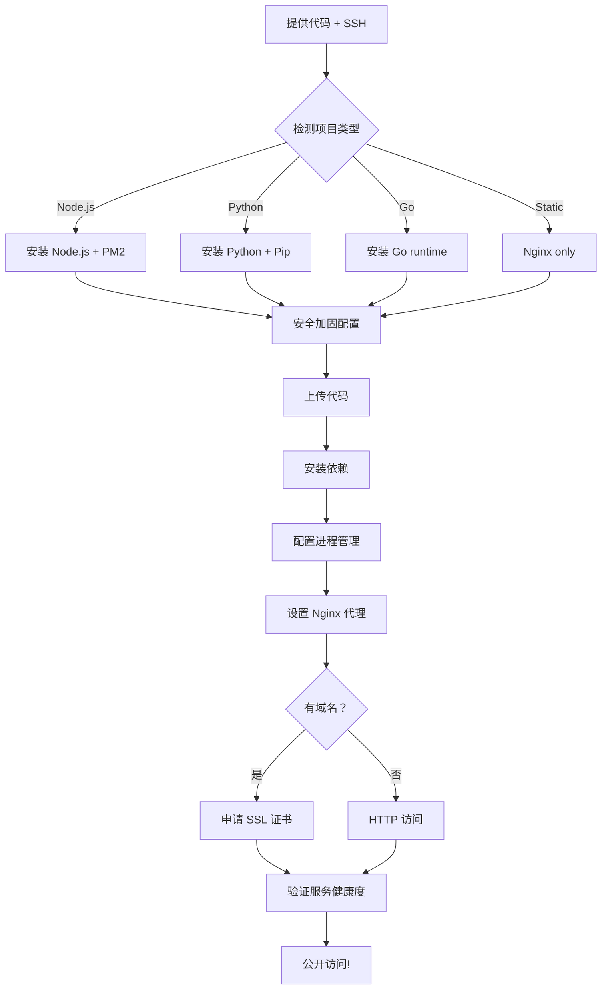

# 🚀 Website Deployment Quick Start

## 使用说明

只需提供**源代码 + SSH 凭证**,即可完成从开发环境到公网可访问生产环境的完整部署!

---

## 一、准备工作

### 1. 获取服务器信息

您需要准备:

| 项目 | 示例值 | 说明 |
|------|--------|------|
| **SSH 用户** | `roo` | 默认管理员账户 |
| **服务器 IP** | `47.100.x.x` | 阿里云 ECS 公网 IP |
| **SSH 端口** | `22` | 如需修改请提前设置 |
| **私钥路径** | `~/.ssh/id_rsa` | SSH 密钥文件位置 |
| **域名 (可选)** | `example.com` | HTTPS 证书需要 |

### 2. 准备代码

支持以下技术栈:

```bash
# Node.js 项目
package.json
├── src/
├── package.json  ← 自动识别

# Python 项目  
requirements.txt
├── app.py
└── requirements.txt  ← 自动识别

# Go 项目
main.go
└── go.mod  ← 自动识别

# 静态网站
index.html
└── static/  ← 自动识别为 Nginx
```

---

## 二、一键部署命令

### 方式 A: 使用自动化脚本 (推荐)

```bash
# 1. 克隆或下载技能包
cd ~/.openclaw/workspace/skills/public/website-deploy/scripts

# 2. 执行部署
python3 deploy-automation.py \
    --host 47.100.x.x \
    --username roo \
    --key ~/.ssh/id_rsa \
    --project my-website \
    --code ./dist \
    --type nodejs \
    --domain mysite.com
```

### 方式 B: 直接告诉我

**您只需要说:**

> "帮我部署一个 Node.js 项目到阿里云 ECS"
> 
> 并附上:
> - 本地代码文件夹路径：`~/projects/my-app/dist`
> - SSH 信息:`roo@47.100.x.x`, 私钥在`~/.ssh/alibaba.key`
> - 域名:`mysite.com`(如有)

我会自动完成所有步骤!

---

## 三、部署流程图



---

## 四、常见部署场景

### 场景 1: Express.js API Server

```bash
python3 deploy-automation.py \
    --host YOUR_IP \
    --key ~/.ssh/key \
    --project api-server \
    --code ./build/api \
    --type nodejs \
    --domain api.mysite.com
```

**部署后访问:**
- API: `https://api.mysite.com`
- Health check: `https://api.mysite.com/health`

---

### 场景 2: React/Vue Frontend

```bash
# 先本地构建
npm run build

# 然后部署
python3 deploy-automation.py \
    --host YOUR_IP \
    --key ~/.ssh/key \
    --project frontend \
    --code ./dist \
    --domain www.mysite.com
```

**部署后访问:**
- 静态文件托管在`https://www.mysite.com`
- 自动配置 CDN 缓存

---

### 场景 3: Django/FastAPI Backend

**Pre-requisite: Configure WSGI entry point (see [WSGI-ENTRY-POINTS.md](references/WSGI-ENTRY-POINTS.md))**

For Django, the entry point is usually `myproject.wsgi:application`
For Flask/FastAPI, it's typically `app:app` or `main:app`

**Option A: Set environment variable before deployment:**
```bash
export WSGI_ENTRY=myproject.wsgi:application

python3 deploy-automation.py \
    --host YOUR_IP \
    --key ~/.ssh/key \
    --project backend \
    --code ./backend_app \
    --type python \
    --domain backend.mysite.com
```

**Option B: Edit systemd service after deployment:**
```bash
# Edit the service file
sudo nano /etc/systemd/system/backend.service

# Change ExecStart line to use correct entry point:
# ExecStart=/var/www/backend/venv/bin/gunicorn ... your.module:application

# Reload and restart
sudo systemctl daemon-reload
sudo systemctl restart backend
```

**部署后访问:**
- Django: `http://backend.mysite.com`
- FastAPI docs: `http://backend.mysite.com/docs`

**Troubleshooting:** If you get 502 Bad Gateway:
1. Check Gunicorn logs: `journalctl -u backend -f`
2. Verify entry point in service file
3. Test manually: `cd /var/www/backend && source venv/bin/activate && gunicorn your.entry.point`

**More details:** See [WSGI-ENTRY-POINTS.md](references/WSGI-ENTRY-POINTS.md) for comprehensive guide

---

## 五、部署检查清单

部署完成后，验证以下几点:

### ✅ 基础验证

- [ ] SSH 可以正常登录
- [ ] Nginx 状态:`systemctl status nginx` → active (running)
- [ ] 防火墙 UFW 开启:`ufw status` → Status: active
- [ ] 应用进程运行中 (PM2/systemd)

### ✅ 功能验证

- [ ] 浏览器访问: `http(s)://your-domain.com`
- [ ] SSL 证书有效:`curl -I https://your-domain.com` → HTTP/2 200
- [ ] API 接口响应正常
- [ ] 日志查看:`pm2 logs project-name` 无报错

### ✅ 监控验证

- [ ] Fail2Ban 正在守护 SSH:`systemctl status fail2ban`
- [ ] Auto-update 已启用:`dpkg -l | grep unattended-upgrades`
- [ ] 错误日志可查:`tail -f /var/log/nginx/error.log`

---

## 六、故障排除

### ❌ SSH 连接失败

```bash
# 检查：确保 SSH 端口在阿里云安全组已开放
# 阿里云控制台 → 云服务器 ECS → 安全组 → 添加入方向规则
# 端口：22, 协议：TCP, 授权对象：0.0.0.0/0
```

### ❌ Nginx 无法启动

```bash
# 检查配置文件语法
sudo nginx -t

# 查看错误详情
sudo tail -f /var/log/nginx/error.log
```

### ❌ 应用进程崩溃

```bash
# PM2 管理的项目
pm2 list
pm2 logs my-project

# Systemd 管理的项目
systemctl status my-project
journalctl -u my-project -n 50
```

### ❌ SSL 证书过期

Let's Encrypt 证书会自动续期 (90 天有效期),手动测试:

```bash
sudo certbot renew --dry-run
```

---

## 七、下一步优化建议

部署完成后可以考虑:

1. **启用 CDN**: Cloudflare/DNSPod 加速全球访问
2. **数据库独立**: 迁移到 RDS MySQL/PostgreSQL
3. **CI/CD 流程**: GitHub Actions 自动部署每次 git push
4. **监控告警**: Prometheus + Grafana 实时性能监控
5. **备份策略**: 每日自动备份代码和数据库到 OSS

---

## 八、技术支持

遇到问题?

| 问题类型 | 解决途径 |
|---------|----------|
| SSH 权限 | 检查阿里云安全组和 SSH 配置 |
| 依赖安装失败 | 查看 `/var/www/{project}/logs/out.log` |
| 内存溢出 | 增加 `max_memory_restart` PM2 配置 |
| 网络不通 | 检查安全组和 UFW 规则 |
| SSL 错误 | 重新运行 `certbot --nginx -d domain` |

---

**准备好了吗?现在就开始您的第一次自动化部署!** 🚀

需要帮助?直接告诉我:"请帮我部署 XXX 项目到阿里云 ECS",我会全程引导!
